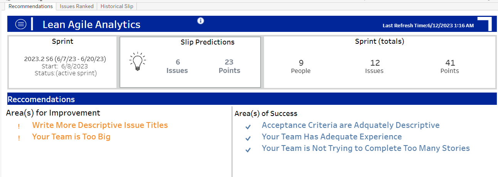
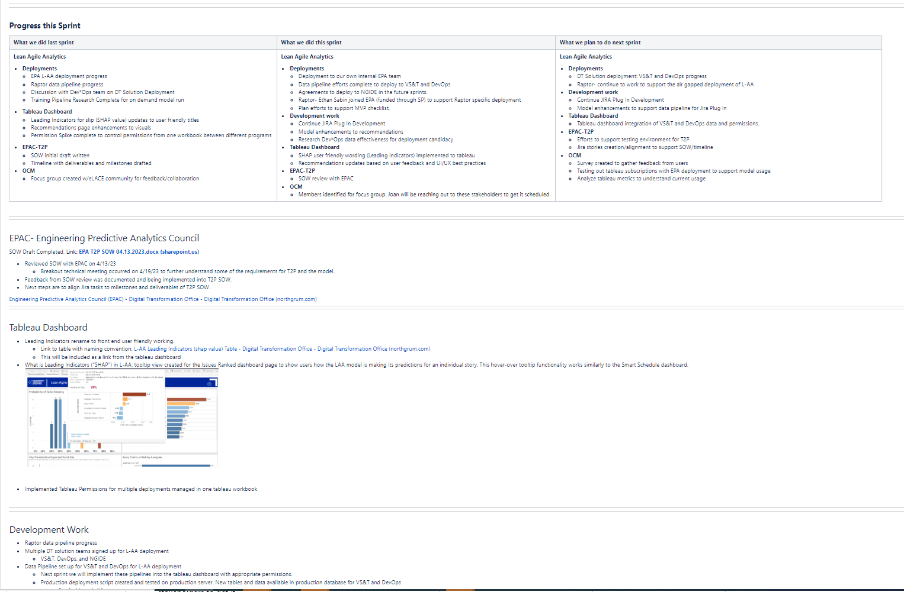

# Kim Welch – Data Analytics, Engineering & Cloud Portfolio

Welcome!  
This portfolio highlights selected projects and work samples demonstrating expertise in **data engineering**, **analytics**, **visualization**, and **cloud-based solutions**.  
Skills showcased include **SQL**, **Python**, **Alteryx**, **ETL workflows**, **Tableau dashboards**, **AI-driven analytics**, and **machine learning integrations**.  
These examples reflect my ability to transform raw data into actionable insights and deliver end-to-end analytical solutions.

---

## 📊 Interactive Dashboards

**Tableau Public Portfolio**  
View my interactive dashboards here: [Tableau Public – Kim Welch](YOUR_TABLEAU_PUBLIC_LINK)  

This portfolio contains interactive dashboards created during graduate coursework and independent projects, focusing on:
- Data storytelling and visual analytics  
- KPI tracking and monitoring  
- Business performance insights  

In my professional role, I have developed additional dashboards for enterprise use. Due to the proprietary and sensitive nature of this work, I have not included them in their entirety. However, I have provided a few screenshots within this portfolio (with all sensitive information fully redacted) to demonstrate my professional design style, layout approach, and storytelling methodology.

---

## 🖼️ Work Sample Dashboards (Redacted)

These are screenshots of dashboards I have designed and developed in a professional setting.  
Proprietary data has been **fully anonymized/redacted** while preserving:
- Layout and design approach
- Metric hierarchy and prioritization
- Storytelling methodology

### Executive Dashboard

### Agile Metrics Dashboard (Sprint View)

### Agile Metrics Dashboard

---

## 🗄️ SQL – Data Transformation & Modeling

Skills:
- Complex joins across multiple tables
- Use of window functions for rolling metrics
- Modular query design using CTEs for clarity and maintainability
- Filtering and aggregation optimized for analytics consumption

---

## 🐍 Python – Data Parsing & Automation

**File:** [`python/data_parser.py`](python/data_parser.py)  
Demonstrates:
- Parsing and cleaning structured or log-style data
- Building reusable transformation functions
- Exporting results to analytics-ready formats (CSV, database table)
- Leveraging `pandas` for data manipulation and summary statistics

---
## ☁️ Cloud, AI & Machine Learning

- Extensive hands-on experience with **Google Cloud Platform** technologies including BigQuery, Dataflow, Pub/Sub, and Cloud Functions.
- Explored prompt engineering and API integrations as part of complex data streaming projects.
- [Read my project reflection and lessons learned here](https://medium.com/@collins.kimberlynicole/project-refl-85ffca311320).
- Check out the [MGMT590 Final Project repository](https://github.com/welch100/MGMT590FinalProject_BrainiacsGroup8) demonstrating our implementation of GCP tools and streaming data pipelines.

---
## 🔄 Alteryx Workflow

  
Demonstrates:
- End-to-end ETL workflow design
- Input from multiple sources (CSV, database connection)
- Complex joins, filtering, and transformation logic
- Output to analytics datasets and visualization tools

---

## 📈 Project Management
Demonstrates:
- Application of Agile project management principles
- Facilitated sprint planning, daily stand-ups, and retrospectives
- Managed product backlog and prioritized features based on stakeholder input
- Coordinated cross-functional team deliverables and removed blockers
- Delivered clear, concise project status presentations to stakeholders and leadership
- Balanced both strategic product vision and tactical sprint execution
**Role:** Scrum Master & Product Owner 

### Agile Status Presentation – Slide 1

### Agile Status Presentation – Slide 2

**Additional Contribution – Tableau User Enablement**  

- Created the **NGC Tableau Welcome Guide**, a comprehensive Tableau Server user manual tailored for new users
- Filled a gap in available Tableau resources by explaining how to interact with Tableau as a consumer
- Collaborated with our Tableau representative to include it in the official "Welcome to Tableau" onboarding materials at NGC
- Supported adoption of Tableau within my program and across the organization

#### Tableau User Guide – Page 1

#### Tableau User Guide – Page 2

---

## 🎥 Presentation Video

**Video:** [Watch Presentation](https://drive.google.com/file/d/1Ev-NAdraV3Zc_VkMotzLJg9o6GGAAOQK/view?usp=sharing)  
Demonstrates:
- Overview of project goals and approach

---

## 🛠️ Skills Highlighted in This Portfolio

- **Data Engineering:** SQL, Python, Alteryx, ETL pipeline design  
- **Analytics Engineering:** Data modeling, KPI definition, dataset stewardship  
- **Visualization & Storytelling:** Tableau, dashboard design, data narratives  
- **Cloud, AI & Machine Learning:** Google Cloud Platform (BigQuery, Dataflow, Pub/Sub, Cloud Functions), prompt engineering, API integrations, AI-powered analytics  
- **Business Acumen:** Translating technical findings into actionable business insights  
- **Collaboration:** Partnering across technical, product, and business teams  

---

## 📬 Contact

- **LinkedIn:** https://www.linkedin.com/in/kim-welch-b4b661a9/
- **Tableau Public:** https://public.tableau.com/app/profile/kimberly.welch1580/vizzes
- **Email:** kcw.welch@gmail.com

---

> **Note:** Some projects contain sample or anonymized data due to confidentiality agreements. All examples reflect my personal work and style, with sensitive details removed.
