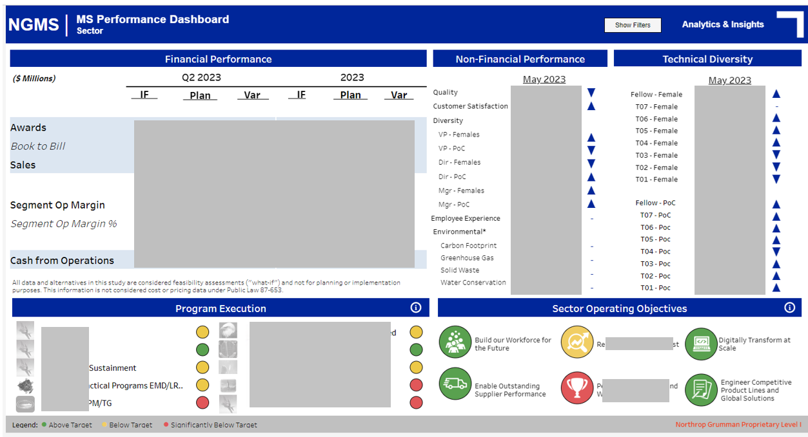

# kim-welch-portfolio
Selected projects and work samples demonstrating skills in data analytics, engineering, and visualization, including interactive Tableau dashboards, SQL scripts, Python automation, and ETL workflows.

# Kim Welch – Data Analytics & Engineering Portfolio

Welcome!  
This repository showcases selected projects and work samples highlighting my skills in **data engineering**, **analytics**, **SQL**, **Python**, **Alteryx**, and **data visualization**.  
These examples demonstrate my ability to transform raw data into actionable insights and deliver end-to-end analytical solutions.

---

## 📊 Interactive Dashboards

**Tableau Public Portfolio**  
View my interactive dashboards here: [Tableau Public – Kim Welch](YOUR_TABLEAU_PUBLIC_LINK)  

This portfolio contains interactive dashboards created during graduate coursework and independent projects, focusing on:
- Data storytelling and visual analytics  
- KPI tracking and monitoring  
- Business performance insights  

In my professional role, I have developed additional dashboards for enterprise use. Due to the proprietary and sensitive nature of this work, I have not included them in their entirety. However, I have provided a few screenshots within this portfolio (with all sensitive information fully redacted) to demonstrate my professional design style, layout approach, and storytelling methodology.
### Executive Dashboard

### Agile Metrics Dashboard (Sprint View)

### Agile Metrics Dashboard

---

## 🖼️ Work Sample Dashboards (Redacted)

These are screenshots of dashboards I have designed and developed in a professional setting.  
Proprietary data has been **fully anonymized/redacted** while preserving:
- Layout and design approach
- Metric hierarchy and prioritization
- Storytelling methodology

*(`images/` folder contains PNG/JPEG files of redacted dashboards.)*

---

## 🗄️ SQL – Data Transformation & Modeling

**File:** [`sql/data_transformation.sql`](sql/data_transformation.sql)  
Demonstrates:
- Complex joins across multiple fact and dimension tables
- Use of window functions for rolling metrics
- Modular query design using CTEs for clarity and maintainability
- Filtering and aggregation optimized for analytics consumption

---

## 🐍 Python – Data Parsing & Automation

**File:** [`python/data_parser.py`](python/data_parser.py)  
Demonstrates:
- Parsing and cleaning structured or log-style data
- Building reusable transformation functions
- Exporting results to analytics-ready formats (CSV, database table)
- Leveraging `pandas` for data manipulation and summary statistics

---

## 🔄 Alteryx Workflow

[z_resources/alteryx_pipeline.png](https://github.com/welch100/kim-welch-portfolio/blob/1552d374de952304b32e4243c119b1a0824265f9/z_resources/alteryx_pipeline.png)
  
Demonstrates:
- End-to-end ETL workflow design
- Input from multiple sources (CSV, database connection)
- Complex joins, filtering, and transformation logic
- Output to analytics datasets and visualization tools

---

## 📈 Project Management

**Role:** Scrum Master & Product Owner 
https://github.com/welch100/kim-welch-portfolio/blob/62661d10f441ec9feb7cfa94b7ed9ddc86953e53/z_resources/project_management_agile_status_presentation.png
https://github.com/welch100/kim-welch-portfolio/blob/62661d10f441ec9feb7cfa94b7ed9ddc86953e53/z_resources/project_management_agile_status_presentation2.png
Demonstrates:
- Application of Agile project management principles
- Facilitated sprint planning, daily stand-ups, and retrospectives
- Managed product backlog and prioritized features based on stakeholder input
- Coordinated cross-functional team deliverables and removed blockers
- Delivered clear, concise project status presentations to stakeholders and leadership
- Balanced both strategic product vision and tactical sprint execution

**Additional Contribution – Tableau User Enablement**  
https://github.com/welch100/kim-welch-portfolio/blob/62661d10f441ec9feb7cfa94b7ed9ddc86953e53/z_resources/tableau_user_guide.png
https://github.com/welch100/kim-welch-portfolio/blob/62661d10f441ec9feb7cfa94b7ed9ddc86953e53/z_resources/tableau_user_guide2.png
- Created the **NGC Tableau Welcome Guide**, a comprehensive Tableau Server user manual tailored for new users
- Filled a gap in available Tableau resources by explaining how to interact with Tableau as a consumer
- Collaborated with our Tableau representative to include it in the official "Welcome to Tableau" onboarding materials at NGC
- Supported adoption of Tableau within my program and across the organization

---

## 🎥 Presentation Video

**Video:** [Watch Presentation](https://drive.google.com/file/d/1Ev-NAdraV3Zc_VkMotzLJg9o6GGAAOQK/view?usp=sharing)  
Demonstrates:
- Overview of project goals and approach

---

## 🛠️ Skills Highlighted in This Portfolio

- **Data Engineering:** SQL, Python, Alteryx, ETL pipeline design
- **Analytics Engineering:** Data modeling, KPI definition, dataset stewardship
- **Visualization & Storytelling:** Tableau, dashboard design, data narratives
- **Business Acumen:** Translating technical findings into actionable business insights
- **Collaboration:** Partnering across technical, product, and business teams

---

## 📬 Contact

- **LinkedIn:** https://www.linkedin.com/in/kim-welch-b4b661a9/
- **Tableau Public:** https://public.tableau.com/app/profile/kimberly.welch1580/vizzes
- **Email:** kcw.welch@gmail.com

---

> **Note:** Some projects contain sample or anonymized data due to confidentiality agreements. All examples reflect my personal work and style, with sensitive details removed.
